<p align="center">
  
</p>

# PE-Claw 1.0

**PE-Claw 1.0** is a rule-based automated power converter design platform for staged power-electronics converter design, component selection, loss estimation, thermal evaluation, Pareto-front analysis, and engineering visualization.

The platform turns user design specifications into an executable converter design workflow:

```text
User specifications
→ topology selection
→ electrical parameter synthesis
→ waveform and stress extraction
→ semiconductor selection
→ capacitor bank selection
→ magnetic/inductor design
→ loss and efficiency analysis
→ volume and hardware overview
→ engineering report artifacts
```

PE-Claw 1.0 focuses on a transparent engineering pipeline rather than a black-box optimizer. Each design stage is rule-based, auditable, and connected to concrete electrical equations, component libraries, and result views.

---

## Highlights

- **GUI-based converter design workflow**
- **Topology-specific electrical parameter synthesis**
- **Waveform generation and operating-point refresh**
- **Semiconductor selection from device libraries**
- **Input/output capacitor Pareto-front selection**
- **Magnetic/inductor Pareto-front design**
- **Semiconductor, capacitor, and magnetic loss estimation**
- **System efficiency and loss breakdown**
- **Hardware volume breakdown and 2D/3D engineering visualization**
- **Efficiency sweep from 0.1 p.u. to 1.0 p.u. load**
- **AI Design mode for deterministic system-level design assistance**

---

## Quick Start

From the project environment where dependencies are installed, launch the GUI with:

```bash
python -m pe_claw_gui
```

Recommended usage:

```text
1. Select converter category and topology.
2. Fill in input voltage, output voltage, power, ripple, frequency, thermal, and device filter settings.
3. Click Run Design.
4. Click Run Capacitor.
5. Click Run Magnetics.
6. Click Generate Waveforms for operating-point refresh.
7. Click Run Efficiency Sweep for 0.1–1.0 p.u. fixed-hardware efficiency analysis.
8. Review Summary, Waveforms, Devices, Capacitors, Inductor, Loss, Efficiency, and Hardware Overview pages.
```

---

## What PE-Claw 1.0 Does

PE-Claw 1.0 is designed around three engineering libraries:

| Library | Purpose |
|---|---|
| **Knowledge Library** | Topology equations, waveform models, stress models, magnetic/capacitor/device design knowledge, loss and thermal models. |
| **Rule Library** | Requirement parsing, topology selection, parameter design, component filtering, Pareto ranking, reporting rules. |
| **Device Library** | Semiconductor devices, magnetic cores and winding options, capacitor candidates, package geometry, thermal and mechanical data. |

The current implementation emphasizes DC-DC converter workflows and an extensible topology-plugin architecture.

---

## Current Workflow

### 1. Run Design

`Run Design` performs:

- topology input parsing;
- topology-specific electrical synthesis;
- waveform generation;
- voltage/current stress extraction;
- semiconductor device selection;
- semiconductor loss and first-pass thermal evaluation;
- initial `DesignReport` generation.

It does **not** run capacitor or magnetic selection.

### 2. Run Capacitor

`Run Capacitor` performs:

- input capacitor current extraction;
- output capacitor ripple analysis;
- capacitor bank selection;
- capacitor loss and thermal proxy estimation;
- input/output capacitor Pareto-front generation;
- recommended capacitor bank selection;
- capacitor geometry artifact generation.

Capacitor selection is anchored to the full-load design point. Operating-point refresh reuses the selected capacitor banks.

### 3. Run Magnetics

`Run Magnetics` performs:

- inductor design request generation;
- magnetic core/winding candidate generation;
- saturation screening;
- core/copper loss estimation;
- thermal proxy estimation;
- Pareto-front compression;
- representative design selection;
- 2D/3D magnetic geometry generation.

Magnetic selection is also anchored to the design point.

### 4. Generate Waveforms

`Generate Waveforms` refreshes operating-point waveforms and losses using the already selected hardware.

It does **not** rerun:

- semiconductor selection;
- capacitor selection;
- magnetic selection;
- Pareto-front optimization;
- geometry generation.

### 5. Run Efficiency Sweep

`Run Efficiency Sweep` evaluates the fixed selected hardware from **0.1 p.u. to 1.0 p.u. load**.

It generates:

- efficiency curve;
- loss breakdown stacked plot;
- peak-efficiency summary;
- full-load efficiency summary;
- dominant loss component.

The sweep is a fixed-hardware operating analysis, not a re-optimized design at each load point.

---

## Supported Result Pages

PE-Claw 1.0 organizes design outputs into multiple result pages:

```text
Summary
Waveforms
Devices
Capacitor PF
Capacitors
Inductor PF
Inductor
Loss
Efficiency
Hardware Overview
```

Each page provides a different engineering view of the same `DesignReport`.

---

## Architecture Overview

PE-Claw 1.0 follows an eight-layer architecture:

| Layer | Role |
|---|---|
| **Layer 1** | GUI entry and state management |
| **Layer 2** | Converter category and topology registry |
| **Layer 3** | Topology input forms |
| **Layer 4** | Topology plugin and physics modeling |
| **Layer 5** | Unified data model and `DesignReport` handoff |
| **Layer 6** | Pipeline orchestration |
| **Layer 7** | Device libraries and multi-physics engines |
| **Layer 8** | Result visualization and engineering outputs |

The active runtime path is:

```text
python -m pe_claw_gui
→ pe_claw_gui.__main__
→ pe_claw_gui.main
→ pe_claw_gui.app.main
→ PEClawMainWindow
→ NavigationBar + Workspace
→ controllers
→ pipeline
→ result views
```

The core topology workflow is:

```text
GUI input
→ topology input form
→ raw_input
→ topology plugin: build_spec()
→ topology plugin: synthesize()
→ topology plugin: generate_waveforms()
→ topology plugin: extract_stress()
→ stress adapter
→ run_device_pipeline()
→ run_capacitor_pipeline()
→ run_magnetic_pipeline()
→ run_loss_pipeline()
→ DesignReport
```

---

## Active Source Layout

```text
src/pe_claw_gui/
├── app/                  # GUI shell, controllers, topology forms, result views
├── agents/               # deterministic report and AI-summary helpers
├── engines/              # devices, capacitors, magnetics, losses, thermal, geometry
├── libraries/            # semiconductor, capacitor, magnetic, thermal, mechanical data
├── models/               # shared dataclasses and DesignReport handoff models
├── pipeline/             # staged design and operating-point pipelines
├── topologies/           # topology registry and active DC-DC topology plugins
├── visualization/        # geometry and result artifact rendering
└── tools/                # audit and maintenance utilities
```

Removed legacy namespaces should not be reintroduced:

```text
topologies/boost/
app/tabs/
topologies/buck/
waveform/
losses/
core/
devices/
```

---

## Case Study: Buck Synchronous Rectified Unidirectional Converter

This section demonstrates the PE-Claw 1.0 workflow using the **Buck Synchronous Rectified Unidirectional** topology.

The case study covers:

```text
Electrical synthesis
→ waveform and stress calculation
→ semiconductor filtering and selection
→ input/output capacitor Pareto-front analysis
→ magnetic/inductor Pareto-front analysis
→ loss and efficiency calculation
→ volume and hardware overview
→ fixed-hardware efficiency sweep
```

### Design Specification

| Parameter | Value |
|---|---:|
| Topology ID | `buck_synchronous_rectified_unidirectional` |
| Nominal input voltage | 500 V |
| Output voltage | 300 V |
| Output power | 5 kW |
| Output current | 16.6667 A |
| Switching frequency | 50 kHz |
| Inductor current ripple | 5 A peak-to-peak |
| Output voltage ripple | 0.6 V peak-to-peak |
| Operating mode | CCM |

### Electrical Parameter Synthesis

PE-Claw calculates the nominal duty ratio, inductor value, output capacitor requirement, inductor ripple, and current stress.

Key results:

| Quantity | Value |
|---|---:|
| Nominal duty ratio | 0.600000 |
| Inductance | 480.000 µH |
| Capacitance | 20.833 µF |
| Inductor current ripple | 5.000 A |
| Output voltage ripple | 0.600 V |
| Inductor peak current | 19.1667 A |
| Inductor valley current | 14.1667 A |
| CCM valid | True |
| High-side RMS current | 12.9529 A |
| Low-side RMS current | 10.5869 A |

<p align="center">
  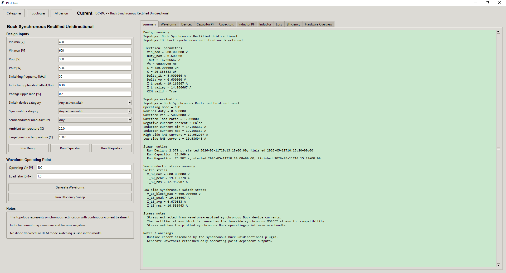
</p>

**Figure: Design summary and topology-level electrical parameters.**

### Operating Waveforms

The topology plugin generates switching-period waveforms for inductor current, switch states, output voltage, and device stress extraction.

<p align="center">
  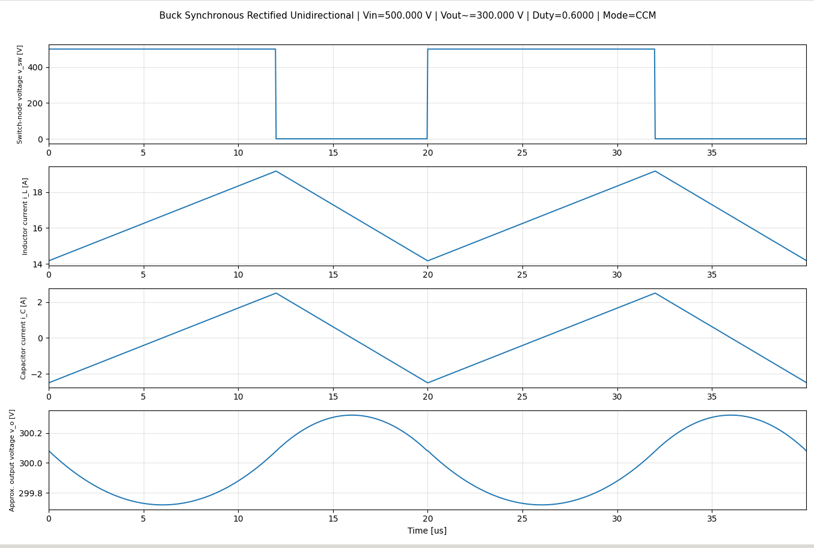
</p>

**Figure: Buck synchronous operating waveforms generated from the topology plugin.**

---

## Semiconductor Selection

PE-Claw searches the semiconductor device library using topology-derived voltage/current stress and user-selected filters.

For this case:

| Role | Registered | After role filter | Passed hard filters | Rejected |
|---|---:|---:|---:|---:|
| Main switch | 440 | 86 | 28 | 58 |
| Synchronous switch | 440 | 86 | 28 | 58 |

Additional settings:

| Item | Value |
|---|---|
| Device type filter | Any |
| Manufacturer filter | Infineon |
| Active semiconductor scheme | Single Device, 1× |
| Recommended semiconductor scheme | Single |

<p align="center">
  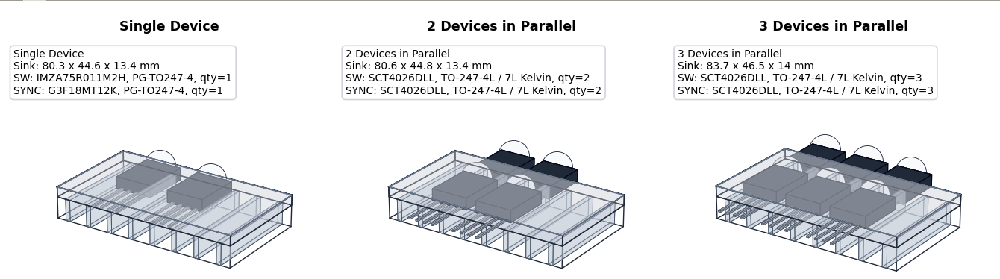
</p>

**Figure: Semiconductor filtering, selected devices, loss, and thermal summary.**

The semiconductor stage estimates conduction loss, switching loss, diode-related loss where applicable, and a first-pass thermal requirement using the selected device and heatsink model.

---

## Input Capacitor Pareto-Front Analysis

The input capacitor design is evaluated against voltage rating, capacitance, ripple current, ESR loss, thermal proxy, and bank volume.

Input capacitor Pareto summary:

| Item | Value |
|---|---:|
| DC voltage | 500 V |
| Ripple target | 0.2 % |
| Evaluated candidates | 1433 |
| Feasible candidates | 1433 |
| Pareto candidates | 18 |
| Recommended policy | minimum-parallel margin-aware recommendation |
| Minimum feasible parallel count | 1 |
| Recommended parallel count | 1 |
| Recommended ripple utilization | 0.809132 |

<p align="center">
  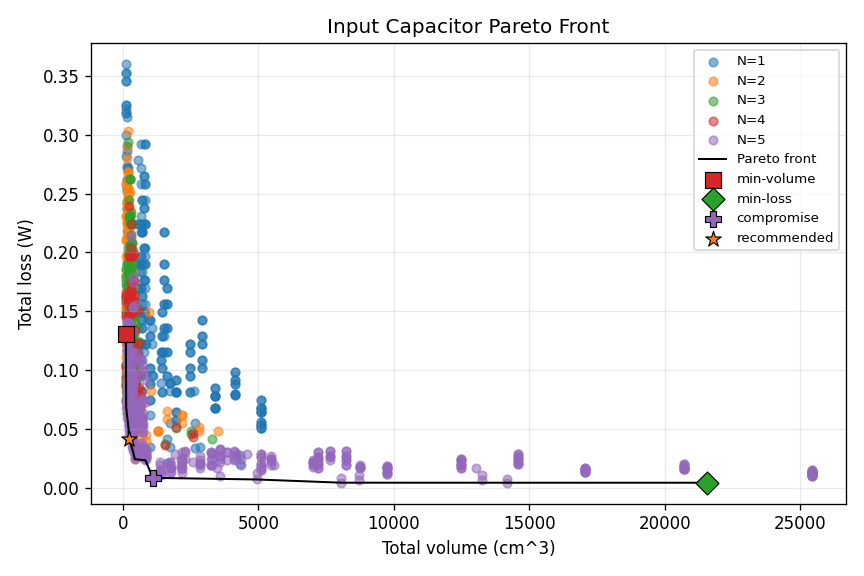
</p>

**Figure: Input capacitor Pareto front with volume-loss tradeoff.**

### Input Capacitor Candidates

PE-Claw shows three representative capacitor-bank designs: minimum volume, minimum loss, and recommended.

| Candidate | Part | Series | N | Equivalent C | Volume | Loss | Footprint |
|---|---|---|---:|---:|---:|---:|---|
| Min-volume | DCP4I059009F | WIMA DC-LINK MKP 4 | 1 | 90 µF | 99.75 cm³ | 0.130391 W | 35 × 57 mm |
| Min-loss | DCHCN07260JJ00KS00 | WIMA DC-LINK HC | 5 | 13000 µF | 21563.1 cm³ | 0.004082 W | 770.2 × 611.1 mm |
| Recommended | C4DEHPQ6100A8TK | C4DE | 1 | 100 µF | 221.671 cm³ | 0.041153 W | 84 × 84 mm |

<p align="center">
  
</p>

**Figure: Input capacitor 2D candidate comparison.**

<p align="center">
  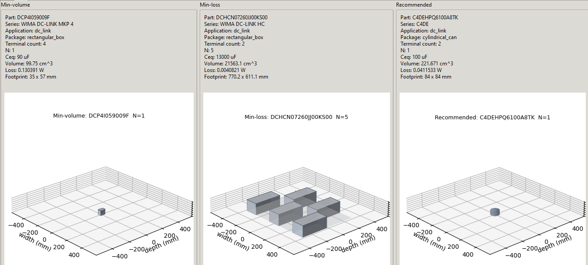
</p>

**Figure: Input capacitor 3D candidate comparison.**

---

## Output Capacitor Pareto-Front Analysis

The output capacitor stage evaluates the output voltage ripple requirement and capacitor-bank ESR loss.

Output capacitor Pareto summary:

| Item | Value |
|---|---:|
| DC voltage | 300 V |
| Ripple target | 0.2 % |
| Evaluated candidates | 2413 |
| Feasible candidates | 2413 |
| Pareto candidates | 36 |
| Recommended policy | minimum-parallel margin-aware recommendation |
| Minimum feasible parallel count | 1 |
| Recommended parallel count | 1 |
| Recommended ripple utilization | 0.755598 |

<p align="center">
  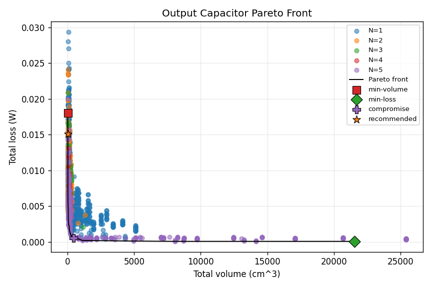
</p>

**Figure: Output capacitor Pareto front with volume-loss tradeoff.**

### Output Capacitor Candidates

| Candidate | Part | Series | N | Equivalent C | Volume | Loss | Footprint |
|---|---|---|---:|---:|---:|---:|---|
| Min-volume | DCP4G052506G | WIMA DC-LINK MKP 4 | 1 | 25 µF | 15.5295 cm³ | 0.018046 W | 17 × 31.5 mm |
| Min-loss | DCHCH07825JJ00KS00 | WIMA DC-LINK HC | 5 | 41250 µF | 21563.1 cm³ | 0.000083 W | 770.2 × 611.1 mm |
| Recommended | DCP4G053006I | WIMA DC-LINK MKP 4 | 1 | 30 µF | 18.4748 cm³ | 0.015108 W | 17 × 31.5 mm |

<p align="center">
  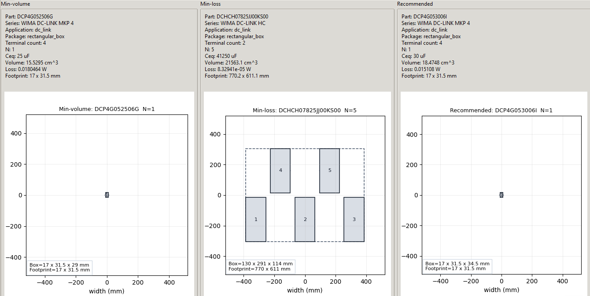
</p>

**Figure: Output capacitor 2D candidate comparison.**

<p align="center">
  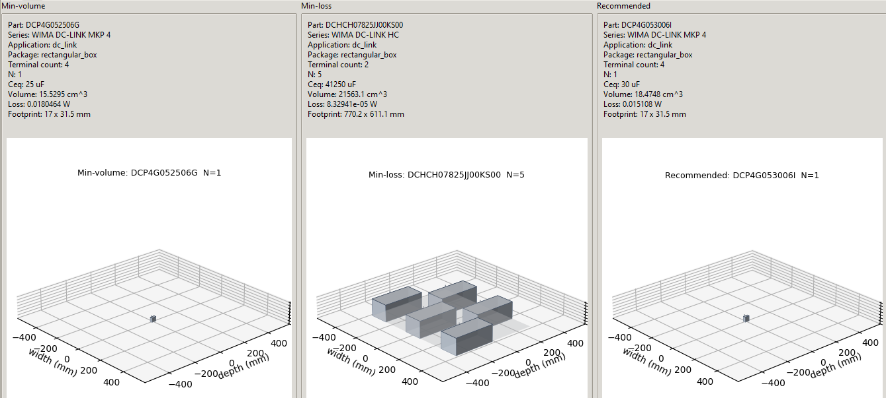
</p>

**Figure: Output capacitor 3D candidate comparison.**

---

## Magnetic / Inductor Pareto-Front Analysis

The magnetic design stage searches a large core/winding design space and compresses candidates into a Pareto front.

Candidate count transitions:

| Stage | Count |
|---|---:|
| Single-core basic feasible | 400937 |
| Single-core after allow screening | 33375 |
| Single-core after compression | 25368 |
| Final after allow screening | 33415 |
| Final after compression | 25408 |
| Pareto points | 39 |

Selected/recommended design:

```text
E_42_21_15_AF_Litz_120x0.15_-_Grade_1_-_Unserved_N14_P6
```

<p align="center">
  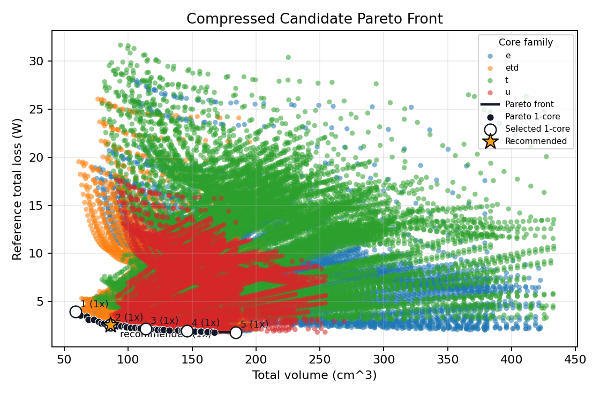
</p>

**Figure: Inductor Pareto front with volume-loss tradeoff.**

### Inductor Candidate Comparison

| Candidate | Design | Volume | Loss | Core family/template | Stack count |
|---|---|---:|---:|---|---:|
| Min-volume | ETD_44_22_15_AF_Litz_120x0.15_-_Grade_1_-_Unserved_N10_P2 | 39.5194 cm³ | 3.59888 W | ETD / paired_etd_core | 1 |
| Min-loss | U_67_27_14_AF_Litz_200x0.18_-_Grade_1_-_Unserved_N20_P6 | 226.006 cm³ | 1.5828 W | U / u_paired_core | 1 |
| Recommended | E_42_21_15_AF_Litz_120x0.15_-_Grade_1_-_Unserved_N14_P6 | 66.9037 cm³ | 2.00604 W | E / paired_box_core | 1 |

<p align="center">
  
</p>

**Figure: Minimum-volume inductor geometry.**

<p align="center">
  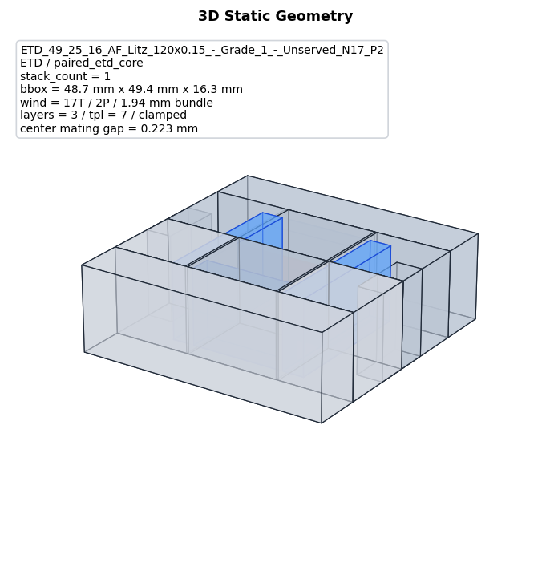
</p>

**Figure: Minimum-volume inductor 3D geometry.**

<p align="center">
  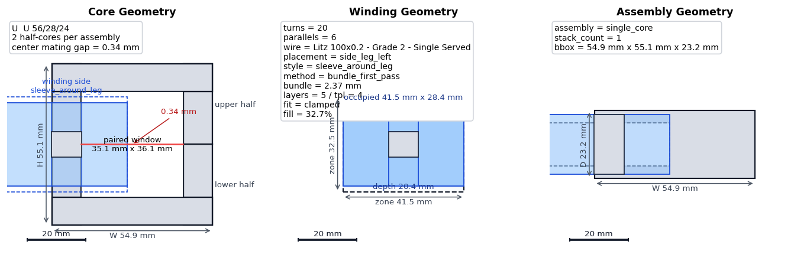
</p>

**Figure: Minimum-loss inductor geometry.**

<p align="center">
  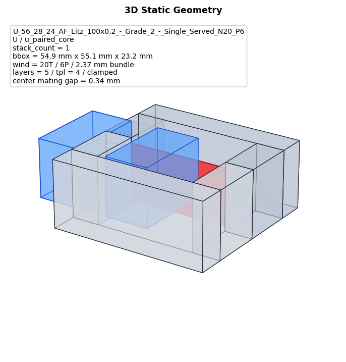
</p>

**Figure: Minimum-loss inductor 3D geometry.**

<p align="center">
  
</p>

**Figure: Recommended inductor geometry.**

<p align="center">
  
</p>

**Figure: Recommended inductor 3D geometry.**

<p align="center">
  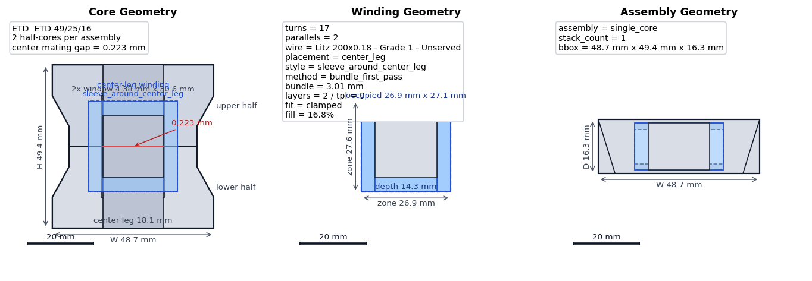
</p>

**Figure: Selected inductor geometry shown by the GUI result page.**

<p align="center">
  
</p>

**Figure: Selected inductor 3D geometry shown by the GUI result page.**

---

## Loss, Efficiency, and Volume Breakdown

PE-Claw combines available semiconductor, magnetic, and capacitor losses into a system-level loss summary.

| Loss component | Value |
|---|---:|
| Total semiconductor loss | 34.1254 W |
| Total magnetic loss | 2.00604 W |
| Total capacitor loss | 0.0741408 W |
| Total estimated loss | 36.2056 W |
| Estimated efficiency | 99.2811 % |

<p align="center">
  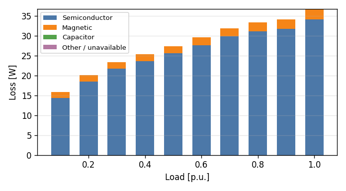
</p>

**Figure: System-level loss breakdown.**

<p align="center">
  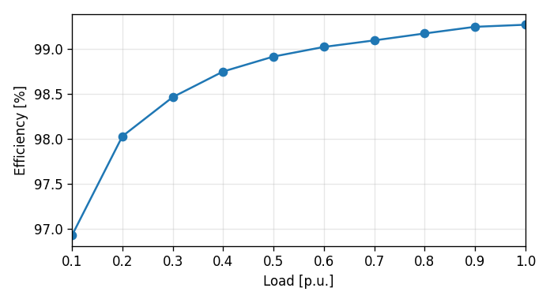
</p>

**Figure: Fixed-hardware efficiency curve from 0.1 p.u. to 1.0 p.u. load.**

The efficiency sweep reuses the selected semiconductor devices, capacitor banks, and magnetic design. It is not a re-optimized design sweep.

---

## Hardware Overview

PE-Claw provides integrated hardware overview artifacts to visualize the engineering-scale component arrangement and volume distribution.

<p align="center">
  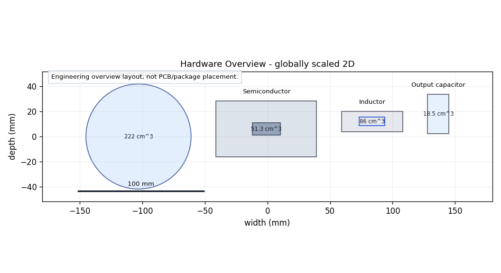
</p>

**Figure: Integrated 2D hardware overview.**

<p align="center">
  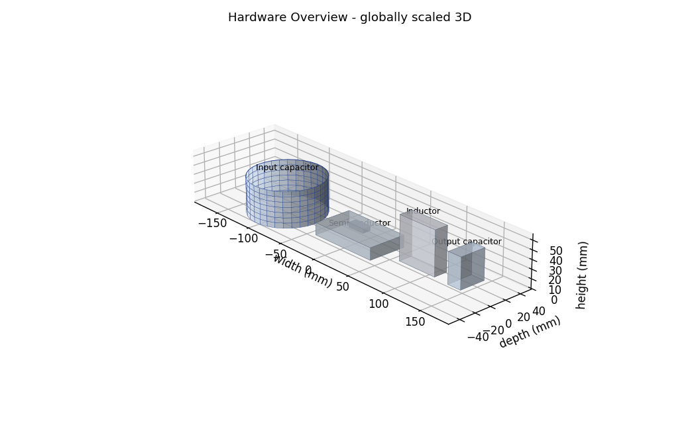
</p>

**Figure: Integrated 3D hardware overview.**

The integrated view is an engineering overview rather than a PCB layout or manufacturable CAD assembly. It places major components in a consistent visual scale:

```text
input capacitor → semiconductor → inductor → output capacitor
```

---

## Additional PE-Claw Version Logos

The repository may also include concept logos for future PE-Claw releases:

<p align="center">
  
  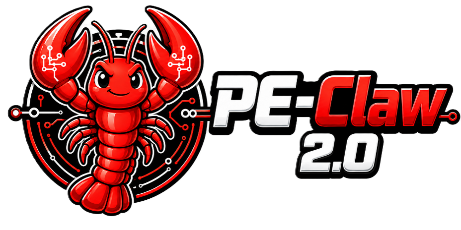
  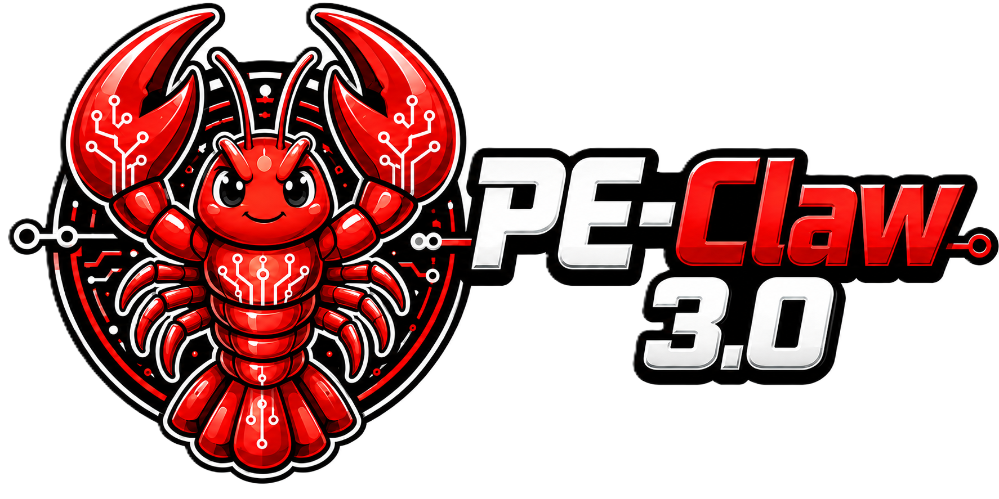
</p>

PE-Claw 1.0 is the rule-based automated design platform. Future versions aim to move toward AI-assisted topology advising, global optimization, explanation generation, and autonomous power converter design agents.

---

## Outputs and Artifacts

Typical PE-Claw outputs include:

```text
DesignReport
waveform plots
semiconductor selection summaries
capacitor Pareto-front plots
capacitor-bank geometry
inductor Pareto-front plots
magnetic geometry
loss breakdown plots
efficiency sweep plots
hardware overview images
CSV / JSON / report artifacts
```

Common artifact folders include:

```text
outputs/capacitor_design/
outputs/magnetic_design/
outputs/efficiency_sweep/
outputs/hardware_overview/
```

---

## Important Design Rules

PE-Claw 1.0 separates design-point selection from operating-point refresh:

- `Run Design` selects semiconductor devices at the design point.
- `Run Capacitor` selects capacitor banks at the design point.
- `Run Magnetics` selects inductor designs at the design point.
- `Generate Waveforms` refreshes operating-point waveform/loss behavior using selected hardware.
- `Run Efficiency Sweep` scans load from 0.1 to 1.0 p.u. using selected hardware.

This prevents expensive hardware re-selection at every operating point and keeps the workflow fast and reproducible.

---

## Current Limitations

PE-Claw 1.0 is an engineering automation prototype. Current limitations include:

- capacitor loss uses first-pass datasheet ESR/Irms models;
- harmonic-by-harmonic high-frequency capacitor loss is future work;
- magnetic loss and thermal estimation are first-pass engineering estimates;
- semiconductor heatsink sizing is proxy-based, not CFD or catalog-optimized;
- cost, availability, and reliability/lifetime prediction are not fully integrated;
- geometry is visualization-oriented and not a manufacturable CAD layout;
- AI Design mode is deterministic and structured-input based;
- natural-language parsing, case memory, surrogate optimization, and self-repair are future work.

---

## Roadmap

### PE-Claw 1.0

Rule-based automated power converter design platform.

```text
user input
→ topology plugin
→ parameter synthesis
→ component selection
→ loss / thermal / volume analysis
→ engineering visualization
```

### PE-Claw 2.0

AI-assisted design co-pilot.

Planned directions:

- natural-language requirement parser;
- topology advisor;
- design-space pruning;
- case retrieval;
- explanation generator;
- surrogate-assisted optimization.

### PE-Claw 3.0

Autonomous power converter design agent.

Planned directions:

- full agentic design loop;
- self-repair candidate generation;
- simulation export;
- BOM and report generation;
- multi-objective global optimization;
- interactive design explanation.

---

## Development Notes

Before modifying the codebase:

1. Read `AGENTS.md`.
2. Keep GUI widgets thin.
3. Put computation in controllers and pipelines.
4. Do not move physics calculations into result views.
5. Preserve design-point vs operating-point separation.
6. Update `report1.md` after every code change.
7. Add focused tests for changed behavior.

Useful validation commands:

```bash
python -m compileall src/pe_claw_gui
python -m pytest -q tests/test_topology_recommender.py tests/test_ai_design_pipeline.py tests/test_ai_design_gui.py
python -m pytest -q tests/test_design_magnetics_button_split.py
python -m pytest -q tests/test_capacitor_pipeline.py
python -m pytest -q tests/test_loss_view_system_summary.py
python -m pytest -q tests/test_semiconductor_operating_refresh_reuses_selection.py
python -m pytest -q tests/test_three_level_tzcm_input_schema.py tests/test_three_level_tzcm_waveform.py
```

---

## License

Add the project license here before public release.

---

## Contact

**Dr. Ziheng Xiao**  
Energy Research Institute @ NTU, Nanyang Technological University, Singapore  
Homepage: <https://lumia-xiao.github.io/>  
Email: Ziheng.xiao@ntu.edu.sg
